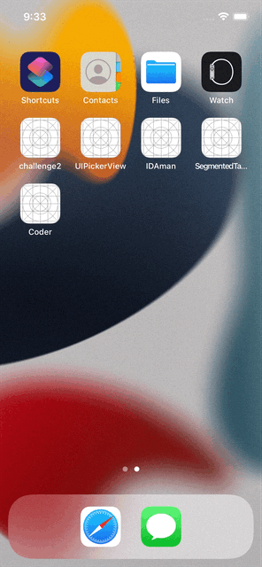

<h1 align="center">Coder</h1> 
## Technologies

* iOS 13+
* UIKit
* MVP
* AutoLayout - programmatically (NSAutoLayoutAnchor)
* URLSession, JSON
* Realm
* Unit Test
* Error Handling
* <a href="https://www.figma.com/file/GRRKONipVClULsfdCAuVs1/KODE-Trainee-Dev-Осень'21?node-id=0%3A1">Design</a>
* <a href="https://kode-education.stoplight.io/docs/trainee-test/b3A6MjUxNDM5Mjg-get-users">API</a>

## App

<table>
    <thead>
        <tr>
            <th>Launch</th>
            <th>Search</th>
            <th>Sorting</th>
        </tr>
    </thead>
    <tbody>
        <tr>
            <td>
                
            </td>
            <td>
                
            </td>
                        <td>
                
            </td>
        </tr>
    </tbody>
</table>

<table>
    <thead>
        <tr>
            <th>Department</th>
            <th>Pull to Refresh</th>
            <th>Call</th>
        </tr>
    </thead>
    <tbody>
        <tr>
            <td>
                
            </td>
            <td>
                
            </td>
                        <td>
                
            </td>
        </tr>
    </tbody>
</table>

<table>
    <thead>
        <tr>
            <th>Data storing</th>
            <th>Network Error</th>
            <th>Internal Error</th>
        </tr>
    </thead>
    <tbody>
        <tr>
            <td>
                
            </td>
            <td>
                
            </td>
            <td>
                
            </td>
        </tr>
    </tbody>
</table>

<table>
    <thead>
        </tr>
    </tbody>
</table>

