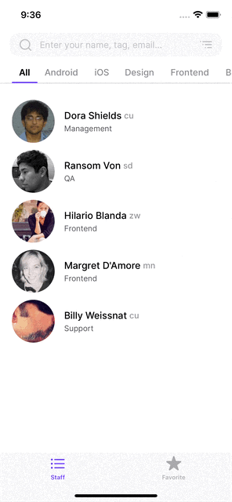
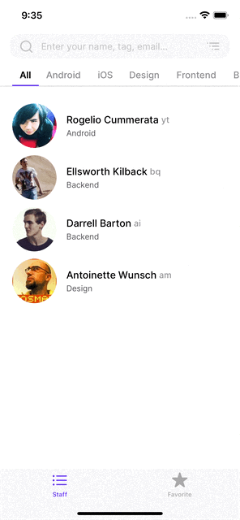
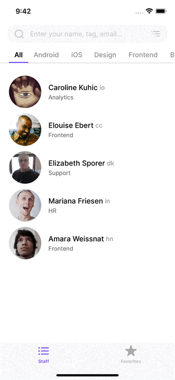
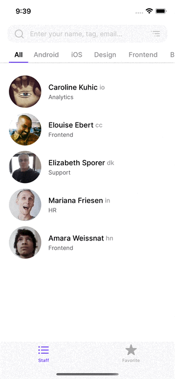
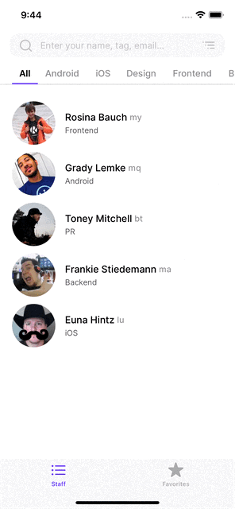
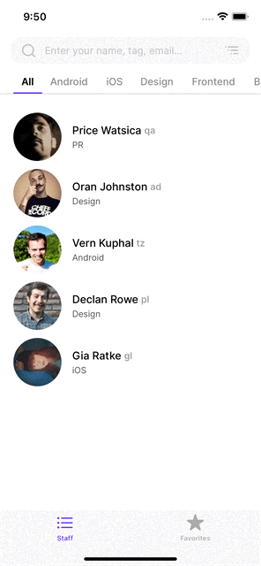
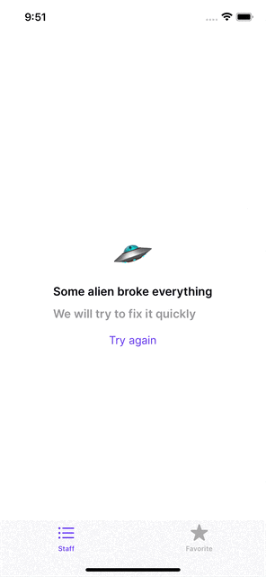

<h1 align="center">Coder</h1> 

## Contents

1. [Description](#description)
2. [Installation](#installation)
3. [App](#app)
4. [Features](#features)

## Description

Test task taken and modified from <a href="https://github.com/appKODE/trainee-test-ios">gitHub</a>

iOS application that makes a request via an open API to get random data about employees of companies.
The app can search by name, sort alphabetically and by the nearest birthday, divide by departments. By
opening a profile user can make a phone call and save person to the Realm local storage. Storage and
deletion from the database is also carried out by swiping to the left of the cell.

## Installation

`pod install` and run `Coder.xcworkspace`

## Technologies

* iOS 13+
* UIKit
* MVP
* AutoLayout - programmatically (NSAutoLayoutAnchor)
* URLSession, JSON
* Realm
* Unit Test
* Error Handling
* <a href="https://www.figma.com/file/GRRKONipVClULsfdCAuVs1/KODE-Trainee-Dev-Осень'21?node-id=0%3A1">Design</a>
* <a href="https://kode-education.stoplight.io/docs/trainee-test/b3A6MjUxNDM5Mjg-get-users">API</a>

## App

<table>
    <thead>
        <tr>
            <th>Launch</th>
            <th>Search</th>
            <th>Sorting</th>
        </tr>
    </thead>
    <tbody>
        <tr>
            <td>
                
            </td>
            <td>
                
            </td>
                        <td>
                
            </td>
        </tr>
    </tbody>
</table>

<table>
    <thead>
        <tr>
            <th>Department</th>
            <th>Pull to Refresh</th>
            <th>Call</th>
        </tr>
    </thead>
    <tbody>
        <tr>
            <td>
                
            </td>
            <td>
                
            </td>
                        <td>
                
            </td>
        </tr>
    </tbody>
</table>

<table>
    <thead>
        <tr>
            <th>Data storing</th>
            <th>Network Error</th>
            <th>API Error</th>
        </tr>
    </thead>
    <tbody>
        <tr>
            <td>
                
            </td>
            <td>
                
            </td>
            <td>
                
            </td>
        </tr>
    </tbody>
</table>

<table>
    <thead>
        </tr>
    </tbody>
</table>

## Features

1. Launch - Shows the skeleton while sending a request to receive data.
2. Search - Search by first name / last name / user tag.
 Shows an error when it does not find a person.
3. Sorting - Sort by alphabet / by the nearest birthday.
4. Department - Divides people by department.
5. Pull to Refresh - Custom refresh spinner with animation which makes new request. (Without third party Library)
6. Call - Calling by tapping to the phone number.
7. Data Storing - Store data to the Realm data storage.
   * Saving and Deleting data by swipe to the left.
   * Saving and Deleting data by tapping to the star in the Profile.
   * Showing saved data in the Favorites screen.
   * Marking saved data by star in the cell.
8. Network Error - A red message appears at the top of the screen when there is an error with the network.
9. API Error - Message with the refresh button in case of an error with the server.
